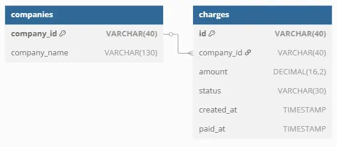

# prueba_next_technologies

## Sección 1: Procesamiento y Transferencia de Datos

### [**1.1 Carga de Información**](https://github.com/JozCrzBrgn/prueba_next_technologies/blob/main/load.py)
- Base de datos: Usaremos MySQL porque es relacional y permite estructurar bien los datos en tablas normalizadas.

- Procedimiento:
    1. Se llevó a cabo un análisis exploratorio de datos [**(EDA)**](https://github.com/JozCrzBrgn/prueba_next_technologies/blob/main/EDA.ipynb) para comprender la estructura, calidad y características del dataset proporcionado. Este análisis permitió identificar la presencia de valores nulos, duplicados o inconsistentes, así como determinar el tipo de transformaciones necesarias para garantizar la integridad y utilidad de los datos.
    2. Para garantizar un entorno de desarrollo consistente y reproducible, se creó un [**Dockerfile**](https://github.com/JozCrzBrgn/prueba_next_technologies/blob/main/Dockerfile) que define la imagen de la aplicación, incluyendo las dependencias necesarias como ***Python***, ***Flask*** y las bibliotecas de manejo de datos.
    3. Adicionalmente, se configuró un archivo [**docker-compose.yml**](https://github.com/JozCrzBrgn/prueba_next_technologies/blob/main/docker-compose.yml) para orquestar los servicios de la aplicación. Este archivo levanta dos contenedores:
        - Un contenedor para la base de datos **prueba_tecnica_db** utilizando *MySQL*.
        - Un contenedor para la aplicación en **Flask**, que se encargará de la api de número naturales.
    4. Se desarrolló un script en *Python* llamado **load.py** cuyo objetivo es crear la tabla ***empresas*** en la base de datos y cargar los datos del archivo *data_prueba_tecnica.csv*. Este script realiza las siguientes tareas:
        - Establece una conexión con la base de datos MySQL.
        - Define el esquema de la tabla empresas, asegurando que los tipos de datos sean consistentes con la naturaleza de la información.
        - Lee el archivo CSV y realiza una inserción masiva de los datos en la tabla.

### [**1.2 Extracción**](https://github.com/JozCrzBrgn/prueba_next_technologies/blob/main/extract.py)
- Se utliza el lenguaje **python**, porque permite manejar archivos en CSV, Parquet, etc. y tambien cuenta con una amplia variedad de librerias para analisis y procesamiento de datos, lo que lo convierte en una herramienta ideal para este tipo de tareas.
- Se uso el formato **CSV** porque es un formato de texto plano, son fáciles de leer, editar y compartir, y pueden ser abiertos con cualquier editor de texto o herramienta de análisis de datos.
- Procedimiento:
    1. Se utilizó la librería **PyMySQL** para establecer una conexión con la base de datos *MySQL*.
    2. Se ejecutó una consulta SQL `SELECT * FROM empresas` para extraer todos los registros de la tabla *empresas*. Esta consulta recupera la información almacenada en la base de datos para su posterior procesamiento.
    3. Los datos obtenidos de la consulta se almacenaron en un archivo CSV utilizando la librería **pandas**.

### [**1.3 Transformación**](https://github.com/JozCrzBrgn/prueba_next_technologies/blob/main/transform.py)
La transformación de los datos se basó en el Análisis Exploratorio de Datos [**(EDA)**](https://github.com/JozCrzBrgn/prueba_next_technologies/blob/main/EDA.ipynb) realizado previamente, el cual permitió identificar valores faltantes, inconsistencias y oportunidades para mejorar la calidad de la información.

- Se cargó la información del archivo CSV generado en la etapa de extracción ***(empresas.csv)*** en un DataFrame utilizando la librería **pandas**. Esto facilitó la manipulación y transformación de los datos.
- **Columna** `id`: Dado que los valores de `id` son únicos y no había forma de recuperar los faltantes, se decidió generarlos artificialmente. Para ello, se implementó una función que crea un hash aleatorio con el mismo formato que los `id` existentes, asegurando que sean únicos y consistentes.
- **Columna** `company_id`: Se utilizó la columna `company_name` para inferir los valores faltantes en `company_id`. Esto se logró mediante un mapeo basado en los valores conocidos de ambas columnas.
- **Columna** `company_name`: Se identificó que los valores **nan**, **MiPas0xFFFF** y **MiP0xFFFF** estaban asociados a **MiPasajefy** con el `company_id` *cbf1c8b09cd5b549416d49d220a40cbd317f952e*. Dado que solo existen dos nombres de compañías en el dataset, se realizó la sustitución manual para corregir esta inconsistencia.
- Se utilizaron las funciones `pd.to_datetime` y `astype` para asegurar que los tipos de datos fueran consistentes con el esquema propuesto:
    - Las columnas de fechas (`created_at` y `paid_at`) se convirtieron al tipo datetime.
    - Las columnas numéricas (`amount`) se ajustaron al tipo decimal.
- Una vez completadas las transformaciones, los datos se guardaron en un nuevo archivo *CSV* llamado **empresas_transformed.csv**. Este archivo contiene la información estructurada y lista para su uso en la siguiente etapa.

### [**1.4 Dispersión de Información**](https://github.com/JozCrzBrgn/prueba_next_technologies/blob/main/dispertion.py)
En esta etapa se estructuran y almacenan los datos transformados en un esquema de base de datos relacional, dividiendo la información en dos tablas relacionadas: **charges (transacciones)** y **companies (compañías)**. Esto permite una organización más eficiente de los datos y facilita su consulta y análisis posterior.

- Se cargó el archivo *empresas_transformed.csv*, generado en la etapa anterior, en un DataFrame utilizando la librería **pandas**. Este archivo contiene los datos ya limpios y transformados, listos para ser almacenados en la base de datos.
- Se diseñó un esquema de base de datos con dos tablas principales:
    - **charges**: Almacena la información de las transacciones, con columnas como `id`, `company_id`, `amount`, `company_status`, `created_at` y `paid_at`.
    - **companies**: Contiene la información de las compañías, con columnas como `id` y `company_name`.
- Se definieron las relaciones entre las tablas mediante una clave foránea en la tabla **charges** que referencia a la tabla **companies**.
- Los datos transformados se insertaron en las tablas correspondientes:
    - Primero, se insertaron los registros en la tabla **companies**, asegurando que cada compañía tuviera un identificador único (`company_id`).
    - Luego, se insertaron los registros en la tabla **charges**, relacionando cada transacción con su compañía correspondiente mediante el `company_id`.

### [**1.5 SQL - Vista de Transacciones por Día**](https://github.com/JozCrzBrgn/prueba_next_technologies/blob/main/view_sql.py)
En esta etapa se crea una vista SQL que permita visualizar el monto total transaccionado por día para cada compañía. Esta vista facilita el análisis de las transacciones diarias y proporciona una herramienta eficiente para generar reportes o realizar consultas adicionales.

- La vista, denominada total_transacciones_por_dia, se diseñó para agrupar las transacciones por compañía y fecha, sumando los montos correspondientes a cada día.
- Se utilizaron las tablas **charges** y **companies**, relacionadas mediante el campo `company_id`, para obtener el nombre de la compañía y los detalles de las transacciones.
- La vista se creó en la base de datos utilizando el comando `CREATE VIEW`.

## Sección 2: Creación de una API
Objetivo: Calcular el número faltante de un conjunto de los primeros 100 números naturales del cual se extrajo uno.

### 2.1 Implementación
- **Flask**: Se eligió Flask por su simplicidad y flexibilidad para crear APIs rápidamente. Es ideal para proyectos pequeños o medianos donde se requiere un servidor ligero y eficiente.
- **Python**: Debido a su facilidad de uso y compatibilidad con Flask.
- **Class** `NaturalNumbers`: Se diseñó una clase llamada **NaturalNumbers** que representa el conjunto de los primeros 100 números naturales. Esta clase incluye los siguientes métodos:
    1. `__init__`: Inicializa el conjunto con los números del 1 al 100.
    2. `extract`: Extrae un número específico del conjunto.
    3. `lost`: Calcula y devuelve los números faltantes en el conjunto.
- **Creación de la API con Flask**: Se configuró Flask para exponer dos endpoints:
    - `/extract`: Permite extraer un número del conjunto.
    - `/find_missing`: Devuelve los números faltantes en el conjunto.
- **Validación de Entradas**: Se implementaron validaciones para asegurar que los datos ingresados por el usuario sean correctos (por ejemplo, que el número a extraer esté dentro del rango permitido).
- La API se probó utilizando **Postman**, una herramienta ampliamente utilizada para probar APIs.

